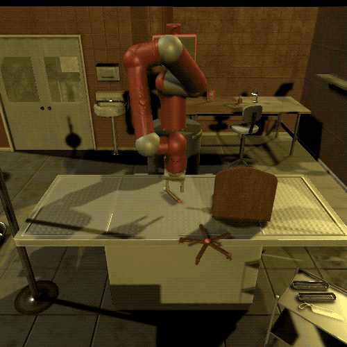
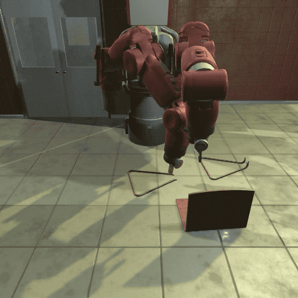
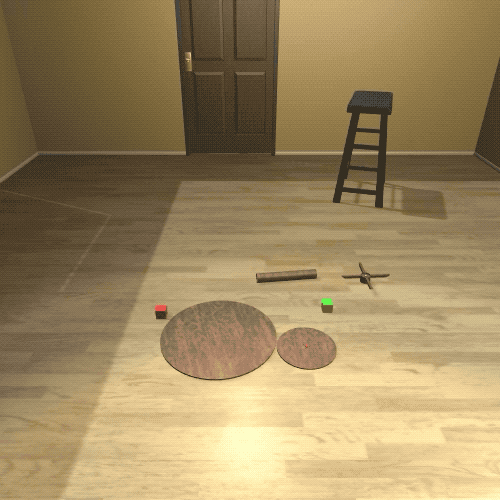

# Double-Threshold Spiking Reinforcement Learning for Energy-efficient Robotic Arm Furniture Assembly
This is the implementation of our DTSN paper, training and evaluation on IKEA.

## (0) IKEA Furniture Assembly Environment 

[[Environment website (https://clvrai.com/furniture)](https://clvrai.com/furniture)]<br/>


||||||
| :---: | :---: | :---: |:---: |:---: |
| Sawyer | Baxter | Cursors | Jaco | Panda |

The IKEA Furniture Assembly environment provides:
- Comprehensive modeling of **furniture assembly** task
- 60+ furniture models
- Configurable and randomized backgrounds, lighting, textures
- Realistic robot simulation for Baxter, Sawyer, Jaco, Panda, and more
- Gym interface for easy RL training
- Reinforcement learning and imitation learning benchmarks
- Teleopration with 3D mouse/VR controller

<br>

## (1) Directories
The structure of the repository:
- `docs`: Detail documentation
- `furniture`:
  - `config`: Configuration files for the environments
  - `env`: Envrionment code of the IKEA furniture assembly
  - `run`: Execution file
- `method`:
  - `algorithms`: Reinforcement learning code
  - `networks`: Ensemble of spiking actor network and critic network
  - `dtsn_sac`: Model of double threshold spiking neuron
 
## (2) Installation

### Prerequisites
- Ubuntu 18.04, MacOS Catalina, Windows10
- Python 3.7 (pybullet may not work with Python 3.8 or higher)
- Mujoco 2.0
- Unity 2018.4.23f1 ([Install using Unity Hub](https://unity3d.com/get-unity/download))

### Installation
1. Install requirements
```bash
git clone https://github.com/Xiangyu-Lee/DTSN.git
cd DTSN
pip install -e .
```

2. Install mujoco 2.0 and add the following environment variables into `~/.bashrc` or `~/.zshrc`
```bash
# download mujoco 2.0
$ wget https://www.roboti.us/download/mujoco200_linux.zip -O mujoco.zip
$ unzip mujoco.zip -d ~/.mujoco
$ mv ~/.mujoco/mujoco200_linux ~/.mujoco/mujoco200

# copy mujoco license key `mjkey.txt` to `~/.mujoco`

# add mujoco to LD_LIBRARY_PATH
$ export LD_LIBRARY_PATH=$LD_LIBRARY_PATH:$HOME/.mujoco/mujoco200/bin

# for GPU rendering (replace 418 with your nvidia driver version)
$ export LD_LIBRARY_PATH=$LD_LIBRARY_PATH:/usr/lib/nvidia-418

# only for a headless server
$ export LD_PRELOAD=/usr/lib/x86_64-linux-gnu/libGLEW.so:/usr/lib/nvidia-418/libGL.so
```

For macOS Catalina, you first have to make `libmujoco200.dylib` and `libglfw.dylib` in `~/.mujoco/mujoco200/bin` executable. Otherwise, the files cannot be opened because they are from an unidentified developer. To resolve this issue, navigate to the directory `~/.mujoco/mujoco200/bin`, right click each file, click `open` in the menu, and click the `open` button.

3. Install python dependencies
```bash
# Run the next line for Ubuntu
sudo apt-get install libgl1-mesa-dev libgl1-mesa-glx libosmesa6-dev patchelf libopenmpi-dev libglew-dev python3-pip python3-numpy python3-scipy

# Run the next line for macOS
brew install gcc
brew install openmpi

# Run the rest for both Ubuntu and macOS
pip install -r requirements.txt
```
3. Download MuJoCo-Unity binary
The Unity binary will be automatically downloaded if the Unity binary is found in `furniture/binary` directory.
You can also manually download pre-compiled Unity binary for your OS from [this link](https://drive.google.com/drive/folders/1w0RHRYNG8P5nIDXq0Ko5ZshQ2EYS47Zc?usp=sharing) and extract files to `furniture` directory.
```bash
# inside the furniture directory
unzip [os]_binary.zip
```
Inside `furniture/binary` there should be `Furniture.app` for macOS, and `Furniture.x86_64, Furniture_Data` for Ubuntu, and `Furniture.exe, Furniture_Data` for Windows.

## (3) Example training and testing
We provide example commands for `table_lack_0825`. You can simply change the furniture name to test on other furniture models.
For evaluation, you can add `--is_train False --num_eval 50` to the training command:
```shell script
# train
python -m run --algo sac --run_prefix sac_table_lack_0825 --env FurnitureSawyerDenseRewardEnv --furniture_name table_lack_0825

